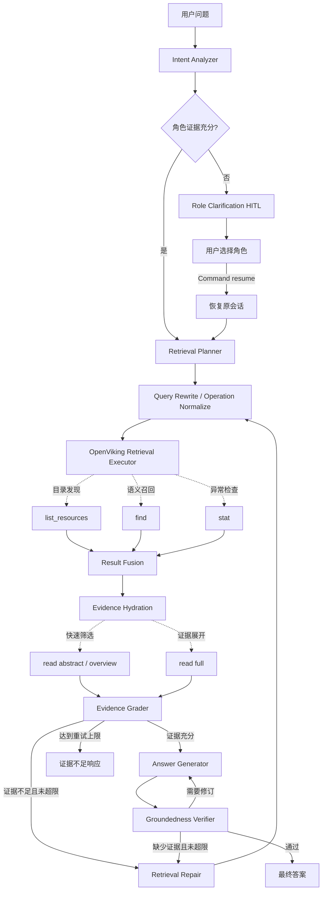

# 第一阶段最小闭环流程方案

## 1. 建设目标

第一阶段实现一个可运行、可中断恢复、可验证证据的只读型 Agentic RAG：

- 识别用户意图和角色。
- 根据角色改写检索问题。
- 组合使用 OpenViking 的目录发现、语义检索、内容读取和资源状态 API。
- 证据不足时自动调整 Query 并重新检索。
- 角色不明确时通过 HITL 询问用户。
- 最终答案必须基于检索证据，并通过 Groundedness 校验。

当前支持的用户角色：

| 角色 | State 值 | 检索与回答侧重点 |
|---|---|---|
| 产品经理 | `product_manager` | 业务目标、用户价值、需求边界、流程、指标、验收标准 |
| 开发 | `developer` | 架构、接口、数据结构、配置、代码实现、部署、故障排查 |
| 新入职员工 | `new_employee` | 背景、术语、前置知识、操作步骤、常见问题、内部流程入口 |

### 1.1 OpenViking API 使用边界

OpenViking API 由确定性 Node 调用，不注册为 LLM Tool。第一阶段只读问答图使用以下能力：

| API | 首期使用 | 使用场景 |
|---|---:|---|
| `find()` | 是 | 根据改写后的 Query 进行语义召回 |
| `list_resources()` | 是 | 浏览授权目录、发现候选 URI、回答目录结构类问题 |
| `read(level="abstract")` | 是 | 低成本读取 L0 摘要，快速判断候选内容 |
| `read(level="overview")` | 是 | 读取 L1 目录或文档概览，补充结构性上下文 |
| `read(level="full")` | 是 | 只对少量高价值 URI 读取 L2 正文，形成最终证据 |
| `stat()` | 条件使用 | 读取失败、资源处理中或状态不明时检查资源状态 |
| `add_url()` | 否 | 属于知识库导入管理流程 |
| `write()` | 否 | 属于知识库写入管理流程 |
| `task_status()` | 否 | 只用于跟踪导入任务 |
| `delete()` | 否 | 属于高风险管理操作，必须独立鉴权和 HITL |

首期 Agent Graph 不允许调用有副作用的 API。它们可以继续保留在内部 API Client 中，但只能由后续独立的知识库管理接口或管理图调用。

## 2. 总体流程



## 3. 核心 Node

### 3.1 Intent Analyzer

职责：

- 识别问题意图、实体、约束和答案要求。
- 判断是否需要知识库检索。
- 从可信用户资料、用户明确自述或会话上下文中判断角色。

角色判断规则：

1. 角色只能是 `product_manager`、`developer`、`new_employee`。
2. 可信用户资料或用户明确自述可以直接确认角色。
3. 通过会话推断时，至少需要两个相互独立且一致的身份线索，且置信度不低于 `0.85`。
4. 单个技术关键词或任务类型不能作为充分证据。
5. 证据不足、冲突或无法映射到角色枚举时，必须进入 HITL。

关键输出：

```json
{
  "intent": "troubleshooting",
  "needs_retrieval": true,
  "user_role": "developer",
  "role_source": "explicit",
  "role_confidence": 1.0,
  "role_evidence": ["用户明确表示自己是开发"],
  "needs_role_clarification": false,
  "answer_requirements": ["定位错误原因", "给出处理步骤"]
}
```

### 3.2 Role Clarification HITL

触发条件：

```text
user_role == null
或 needs_role_clarification == true
```

系统通过 LangGraph `interrupt()` 返回：

```json
{
  "type": "role_clarification",
  "question": "为了按合适的视角改写问题并检索知识库，请问您当前的角色是：产品经理、开发，还是新入职员工？",
  "options": [
    {"label": "产品经理", "value": "product_manager"},
    {"label": "开发", "value": "developer"},
    {"label": "新入职员工", "value": "new_employee"}
  ]
}
```

用户选择后，客户端使用 `Command(resume=...)` 恢复同一个 `thread_id`。服务端完成枚举校验后更新：

```json
{
  "user_role": "developer",
  "role_source": "hitl",
  "role_confidence": 1.0,
  "role_evidence": ["用户通过角色澄清确认"],
  "needs_role_clarification": false
}
```

确认后的角色保存在当前 Thread State，同一会话后续问题直接复用。

### 3.3 Retrieval Planner

职责：

- 将答案要求拆分为最多 4 个检索任务。
- 为每个任务选择 `find`、`list_resources` 或条件性的 `stat` 操作。
- 根据操作设置 `target_uri`、`limit`、`recursive`、`node_limit` 和后续 `hydration_level`。
- `target_uri` 只能从后端授权范围中选择；当前 `find()` 的 `context_type` 固定为 `resource`，不检索 memory 或 skill。

推荐任务结构：

```json
{
  "task_id": "r1",
  "purpose": "查找认证接口的调用方法",
  "operation": "find",
  "information_need": "认证接口参数、请求示例和错误处理",
  "target_uri": "viking://resources/api",
  "limit": 8,
  "hydration_level": "full"
}
```

操作选择规则：

- 目标 URI 不明确或问题询问目录结构时，先使用 `list_resources()`。
- 需要查找概念、机制、步骤、配置或故障原因时，使用 `find()`。
- 已知精确 URI 时，可以跳过语义召回，直接进入 Evidence Hydration。
- 资源不可读、疑似处理中或状态不明时，才追加 `stat()`，不把它作为常规检索调用。

### 3.4 Query Rewrite

职责：

- 只把 `operation=find` 的任务改写为脱离对话也能理解的独立 Query。
- 根据已确认角色调整信息侧重点。
- 保留产品名、方法名、错误码、配置项、版本和硬约束。
- 不得改变用户原始意图或补充不存在的事实。
- `list_resources`、`read` 和 `stat` 使用结构化 URI 参数，不生成无意义的语义 Query。

示例：

```text
原问题：OpenViking find 怎么用？

产品经理：
OpenViking find 的业务使用场景、能力边界、流程和验收标准

开发：
OpenViking find SDK 的接口参数、调用示例、返回结构和异常处理

新入职员工：
OpenViking find 的基本概念、使用前提、入门步骤和常见问题
```

### 3.5 OpenViking Retrieval Executor

该 Node 不让 LLM 自由选择 API，而是严格执行 Retrieval Planner 生成并经服务端校验的结构化任务。

调用策略：

1. `list_resources()`：在授权范围内发现目录和文件 URI，结果进入候选 URI 集合。
2. `find()`：执行语义召回，返回 URI、摘要、分数和上下文类型。
3. `stat()`：仅在资源读取异常或状态不明时调用，区分“不存在”“处理中”和“暂时不可读”。
4. 多个只读任务可通过 `asyncio.gather()` 并行执行，但必须受并发上限控制。
5. API 异常写入 `retrieval_errors`，由路由决定重试、降级或返回证据不足，不把异常文本直接交给 LLM。

### 3.6 Result Fusion

职责：

- 合并 `list_resources()`、`find()` 和条件性 `stat()` 的结果。
- 按 URI 去重。
- 保留来源和任务映射。
- 将目录项和语义命中统一转换为候选 URI。
- 控制进入 Evidence Hydration 的候选数量。

### 3.7 Evidence Hydration

对 Result Fusion 选出的少量候选 URI 分级读取内容：

1. 优先使用 `read(level="abstract")` 获取 L0 摘要，快速过滤无关候选。
2. 对目录类或结构性问题使用 `read(level="overview")` 获取 L1 概览。
3. 只对与 `answer_requirements` 高度相关的 URI 使用 `read(level="full")` 获取 L2 正文。
4. 已知精确 URI 的问题可以直接读取对应层级，无需先调用 `find()`。
5. 读取失败时可以调用 `stat()` 判断资源状态，但不能自动转入写入、导入或删除操作。

Hydration 采用“先轻后重”策略，避免对全部召回结果读取全文。

### 3.8 Evidence Grader

逐项检查 `answer_requirements` 是否有直接证据支持。

路由：

- 证据充分：进入 Answer Generator。
- 证据不足且仍有检索轮次：进入 Retrieval Repair。
- 达到检索上限：返回证据不足响应，不继续猜测。

### 3.9 Retrieval Repair

根据缺失的答案要求选择新的检索角度或 API 组合，而不只是调整原 Query 语序：

- 语义召回不足：修改 Query 后再次 `find()`。
- 检索范围不明确：先 `list_resources()` 缩小 URI 范围。
- 已有候选但证据过浅：从 `abstract/overview` 升级到 `full`。
- 资源状态异常：调用 `stat()` 后决定重试或停止。

硬限制：

```text
MAX_RETRIEVAL_ROUNDS = 2
MAX_PARALLEL_TASKS = 4
MAX_RESULTS_PER_TASK = 10
MAX_LISTED_RESOURCES = 100
MAX_HYDRATED_RESOURCES = 8
MAX_FULL_CONTENT_RESOURCES = 4
```

### 3.10 Answer Generator

只使用选中的证据生成答案，并为关键结论关联对应的 Viking URI。不得把“没有检索到”表述为“事实不存在”。

### 3.11 Groundedness Verifier

检查：

- 关键结论是否有证据支持。
- 引用 URI 是否真实存在于本轮检索结果中。
- 是否遗漏答案要求。
- 是否包含与证据冲突或无依据的内容。

校验不通过时，只允许修订一次；若问题是证据不足，则返回 Retrieval Repair。

## 4. 最小 State

```python
class AgentState(TypedDict):
    thread_id: str
    user_query: str
    normalized_query: str

    user_role: Literal[
        "product_manager",
        "developer",
        "new_employee",
    ] | None
    role_source: Literal["profile", "explicit", "inferred", "hitl"] | None
    role_confidence: float
    role_evidence: list[str]
    needs_role_clarification: bool

    intent: str
    answer_requirements: list[str]
    retrieval_tasks: list[dict]
    executed_queries: list[str]
    executed_operations: list[dict]
    retrieval_round: int

    raw_results: list[dict]
    candidate_uris: list[str]
    hydrated_evidence: list[dict]
    retrieval_errors: list[dict]
    selected_evidence: list[dict]
    missing_requirements: list[str]

    draft_answer: str
    final_answer: str
    route: str
```

API Key 不得写入 State、Checkpoint、Prompt 或 Trace。

## 5. Checkpoint 与恢复

- 使用 PostgreSQL Checkpointer 保存图状态。
- API 请求中的会话标识映射为 LangGraph `thread_id`。
- HITL 恢复必须继续使用原 `thread_id`。
- Checkpoint 保存已确认角色、检索轮次、已执行 Query、API 操作记录、候选 URI 和证据评估结果。
- 角色默认只在当前会话复用，不自动写入长期 Memory。

## 6. 最小接口交互

### 6.1 正常问答

```text
POST /api/v1/chatbot/chat
    -> 执行 Agent Graph
    -> 返回最终答案和引用 URI
```

### 6.2 角色澄清

```text
POST /api/v1/chatbot/chat
    -> Agent interrupt
    -> 返回 role_clarification 和三个选项

POST /api/v1/chatbot/chat
    -> 使用同一 JWT Session 提交角色值
    -> 服务端检测 Checkpoint 中存在 next node
    -> 自动执行 Command(resume=role)
    -> 恢复原图并继续检索
```

## 7. 首期验收标准

1. 用户明确说明角色时，不触发 HITL。
2. 只有“接口怎么调用”等弱线索时，必须触发 HITL。
3. HITL 只接受三个固定角色值。
4. HITL 恢复后继续原 `thread_id`，不丢失原问题。
5. 同一会话后续请求能够复用已确认角色。
6. 三种角色生成的 Query 侧重点不同，但原始意图和约束保持一致。
7. 目录结构类问题能够使用 `list_resources()`，而不是强制转换为 `find()`。
8. 语义问题能够通过 `find()` 召回候选 URI。
9. 候选内容先读取 `abstract/overview`，只对有限数量的高价值结果读取 `full`。
10. 已知精确 URI 时可以跳过 `find()`，直接读取对应内容。
11. 资源状态异常时能够调用 `stat()`，且不会自动触发写入或删除。
12. 证据不足时最多执行两轮检索。
13. 达到检索上限后明确返回缺失信息，不生成无证据结论。
14. 最终答案中的引用 URI 必须来自本轮实际读取的证据。
15. Groundedness 校验失败时能够修订或补检索，并且不会无限循环。
16. 问答主图不会调用 `add_url()`、`write()`、`task_status()` 或 `delete()`。

## 8. 第一阶段暂不实现

- 知识库导入、写入、删除和发布管理流程。
- SQL、文件修改等有副作用工具。
- 跨会话长期角色画像。
- 跨多层目录的递归 Hydration 和复杂 RRF；首期只实现受限的 L0/L1/L2 分级读取。
- 高风险操作审批型 HITL。
- 多 Agent 协作。

## 9. 当前实现映射

| 方案组件 | 实现位置 |
|---|---|
| AgentLoop Node 与路由 | `app/core/langgraph/agent_loop.py` |
| Agent State | `app/schemas/graph.py` |
| 结构化输出 Schema | `app/schemas/agentic_rag.py` |
| Node Prompt | `app/core/prompts/agentic_rag_prompts/` |
| OpenViking 内部 API | `app/services/openviking/api.py` |
| PostgreSQL Checkpointer 接入 | `app/core/langgraph/graph.py` |
| AgentLoop 测试 | `tests/test_agent_loop.py` |

为避免旧版 `chat ↔ tool_call` Checkpoint 污染新图，内部 Checkpoint thread ID 使用
`{session_id}:agentic-rag-v1`。外部 JWT、Session ID 和接口参数保持不变。
